# 🌱 nodi

**An AI chat service that shows each conversation as a tree of question–answer nodes.**

[](https://opensource.org/licenses/MIT) [](https://www.typescriptlang.org/) [](https://nextjs.org/) [](https://react.dev/) [](https://www.python.org/) [](https://fastapi.tiangolo.com/) [](https://www.postgresql.org/) [](https://www.docker.com/)

**English** | [한국어](README.ko.md)

[](https://ai.google.dev)

---

## 💭 Developer's Note

> *"A conversation with AI branches like a tree, not a single line."*

<!-- TODO: 개발 동기 -->

---

## ✨ Features

### 🌳 Tree Conversations
- One question and its answer form one node (`nodes.parent_id`); a session keeps its current head node
- The AI receives only the ancestor chain of the node you continue from; sibling branches are left out
- Answers stream over SSE; each node gets an automatic short label (up to 10 characters) and 1–3 concept tags
- The tree is drawn top to bottom with D3; dragged node positions are saved in one bulk request

### 🔗 Memory Linking
- Right-click a node → **기억 연결**, then click a node in another branch; the link is drawn as an orange line
- When you send a message, only the linked nodes below the lowest common ancestor are added as reference context (up to 12 nodes, 400 characters per answer)

### 🧭 Navigator Questions
- When a branch has at least 3 nodes that share a concept tag, follow-up questions appear as dashed nodes in the tree
- Clicking one shows the question and what it covers (stored with the node, no extra AI call); **질문하기** asks it on that branch
- Thresholds and question count are runtime settings

### 📄 File RAG
- Upload PDF, text, Markdown or image files; text comes from pypdf or Gemini OCR (images)
- Text is split into chunks and embedded with `gemini-embedding-001` (768 dimensions) into pgvector
- A file linked to a node applies to that node's branch; the top 5 chunks are added to the prompt and shown as sources under the answer
- When a question matches an unlinked file closely enough (cosine distance cutoff), the app suggests linking it

### 🏠 Home and Concepts
- Home shows the most used concepts, recent conversations and AI starter questions
- The overseer chat ("총괄 AI") reads your spaces, recent sessions and concepts through read-only skills and replies with buttons to open or create a session
- The concept page groups all tags by how often they are used

### 👩‍🏫 Classes
- Teachers create classes with a 6-character join code; students join from onboarding or their profile
- Teachers read students' class conversations (read only) and upload class materials that all members can use for RAG

### 🛠️ Admin Console
- Change user roles (student / teacher / admin)
- Edit runtime settings stored in the database (model names, navigator and RAG parameters)
- Token usage per user (overseer skill steps) and chat turn logs with prompt, answer and used context (refreshed every 5 seconds)

### 👤 Accounts and Access
- Sign up / sign in with username and password (bcrypt hash, JWT in an httpOnly cookie)
- Access rules for personal and class data are checked in the backend's access layer on every query

---

## 🚀 Getting Started

### Prerequisites
- [Docker](https://docs.docker.com/get-docker/) with Docker Compose
- (Optional, for AI features) a [Google Gemini API key](https://aistudio.google.com/apikey)

### Run

```bash
git clone https://github.com/Nodi-Laboratory/Nodi.git
cd Nodi
cp .env.example .env
docker compose up
```

Open http://localhost:3000 (change `WEB_PORT` in `.env` if the port is in use).

On first start the `migrate` service applies the database schema and loads demo data (accounts, conversations, a class and files).

### Demo Accounts

| Username | Password | Role |
|----------|----------|------|
| `demo` | `demo1234` | Student |
| `teacher` | `demo1234` | Teacher |
| `admin` | `demo1234` | Admin |

### Gemini API Key
Without a key you can sign in and browse every screen: conversation trees, concepts, files, the teacher console and the admin console. Sending chat messages, the overseer chat, starter questions, navigator questions and file indexing are disabled until a key is added.

1. Click the key icon in the sidebar (or **Gemini API 키** in the account menu)
2. Paste your key and click **저장** (Save)
3. The key is stored only in your browser's localStorage and is sent to the backend as an `X-Gemini-Key` header on AI requests; the server does not save or log it

---

## 🛠️ Tech Stack

| Category | Technology |
|----------|-----------|
| **Frontend** | Next.js 16, React 19, TypeScript |
| **State / Data** | TanStack Query 5, Zustand |
| **Visualization** | D3.js 7 |
| **Styling** | Tailwind CSS 4 |
| **Markdown** | react-markdown |
| **Backend** | Python 3.12, FastAPI, asyncpg |
| **AI** | Google Gemini API (`google-genai`: chat, labels, tags, OCR, embeddings) |
| **Database** | PostgreSQL 16, pgvector, dbmate (migrations) |
| **Auth** | bcrypt, python-jose (JWT in an httpOnly cookie) |
| **Files** | pypdf, local volume storage |
| **Infra** | Docker Compose |
| **Screenshots** | Playwright |

---

## 📁 Project Structure

```
Nodi/
├── 📂 frontend/
│   ├── 📂 src/
│   │   ├── 📂 app/                    # Pages: login, home, space, concepts, profile, teacher, admin
│   │   ├── 📂 components/
│   │   │   ├── 📂 workspace/          # Chat panel, D3 session graph, files panel, navigator popup
│   │   │   ├── 📂 home/               # Concept bubbles, overseer chat
│   │   │   ├── 📂 teacher/            # Class list, student threads, class materials
│   │   │   ├── 📂 admin/              # Roles, runtime settings, usage, logs
│   │   │   └── 📂 settings/           # Gemini API key dialog and notices
│   │   ├── 📂 lib/
│   │   │   ├── api.ts                 # Fetch wrapper for /api, SSE parsing
│   │   │   ├── geminiKey.ts           # Gemini key in localStorage
│   │   │   └── useWorkspaceChat.ts    # Chat streaming and optimistic nodes
│   │   ├── 📂 store/                  # Zustand stores (workspace, preferences)
│   │   └── proxy.ts                   # Redirects to /login without a session cookie
│   ├── next.config.ts                 # /api/* rewrite to the backend
│   └── Dockerfile
├── 📂 backend/
│   ├── 📂 app/
│   │   ├── 📂 db/                     # asyncpg pool, query builder, access rules
│   │   ├── 📂 auth/                   # Password hashing, session cookie, current user
│   │   ├── 📂 routers/                # auth, sessions, chat, nodes, files, tags, home, overseer, teacher, admin
│   │   ├── 📂 services/               # Gemini calls, tagging, memory linking, navigator, RAG, file pipeline
│   │   ├── 📂 ai/                     # Skill runner and read-only skills for the overseer
│   │   ├── ai_key.py                  # X-Gemini-Key handling and log redaction
│   │   └── main.py                    # FastAPI entry
│   └── Dockerfile
├── 📂 db/
│   ├── 📂 migrations/                 # Schema (dbmate)
│   └── 📂 seed/                       # Demo data and sample files
├── 📂 scripts/
│   └── 📂 capture-screenshots/        # Playwright script for README screenshots
├── 📂 image/                          # Screenshots
├── docker-compose.yml                 # db, migrate, backend, frontend
└── .env.example
```

---

## 💡 How to Use

1. **Sign in**: Use a demo account or create one on the sign-up tab
2. **Add a key**: Enter your Gemini API key from the key icon in the sidebar to enable AI features
3. **Start a conversation**: Open **개인** (personal space), click **새 대화**, and send a question
4. **Branch**: Select an earlier node in the tree and send a new question; it becomes a new branch from that node
5. **Link memory**: Right-click a node → **기억 연결** → click the target node; the other branch is used as reference context
6. **Use files**: Upload a file in the **자료** panel, click **그래프에 추가**, then right-click the file node and click a conversation node to link it
7. **Join a class**: Enter a join code on the profile page; class conversations appear in the class space
8. **Teach**: Sign in as `teacher` to read students' class conversations and upload class materials

---

## 👥 Team

<!-- TODO: 팀원 정보 (이름 | 역할) -->

| Name | Role |
|------|------|
|  |  |

---

## 🎨 Screenshots

<p align="center">
  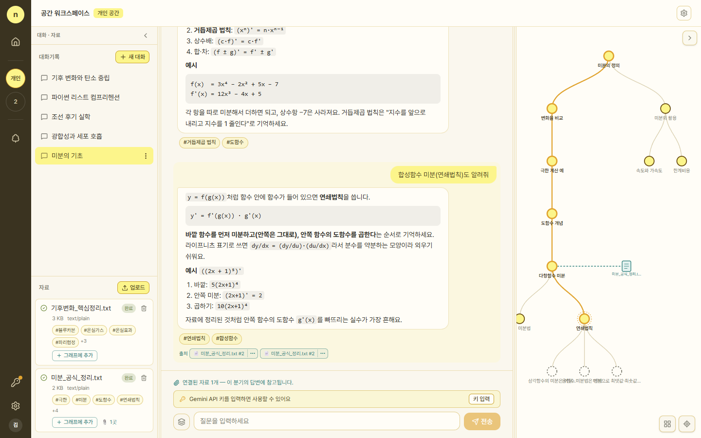
</p>

<table>
  <tr>
    <td align="center">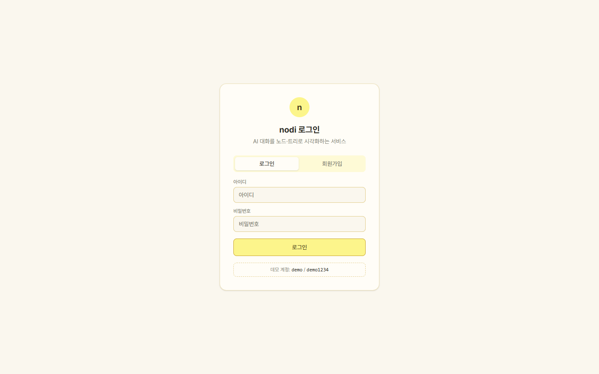<br><sub>Sign in</sub></td>
    <td align="center">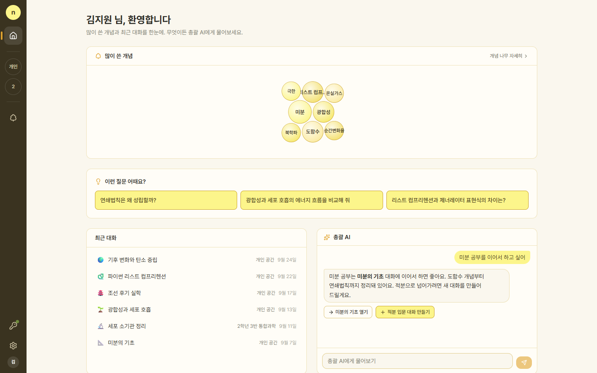<br><sub>Home with overseer chat</sub></td>
  </tr>
  <tr>
    <td align="center">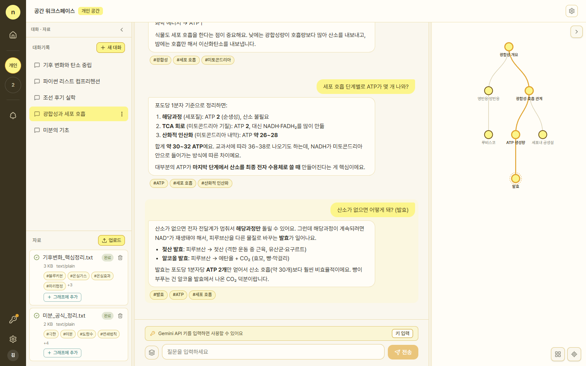<br><sub>Branching conversation</sub></td>
    <td align="center">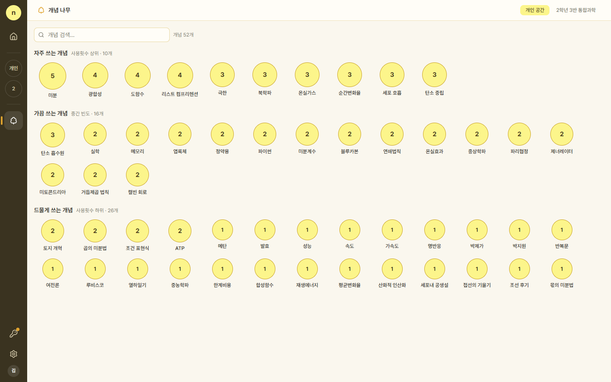<br><sub>Concepts</sub></td>
  </tr>
  <tr>
    <td align="center">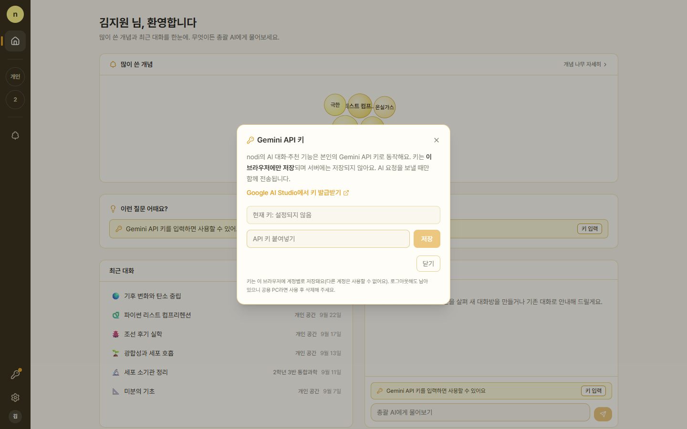<br><sub>Gemini API key settings</sub></td>
    <td align="center">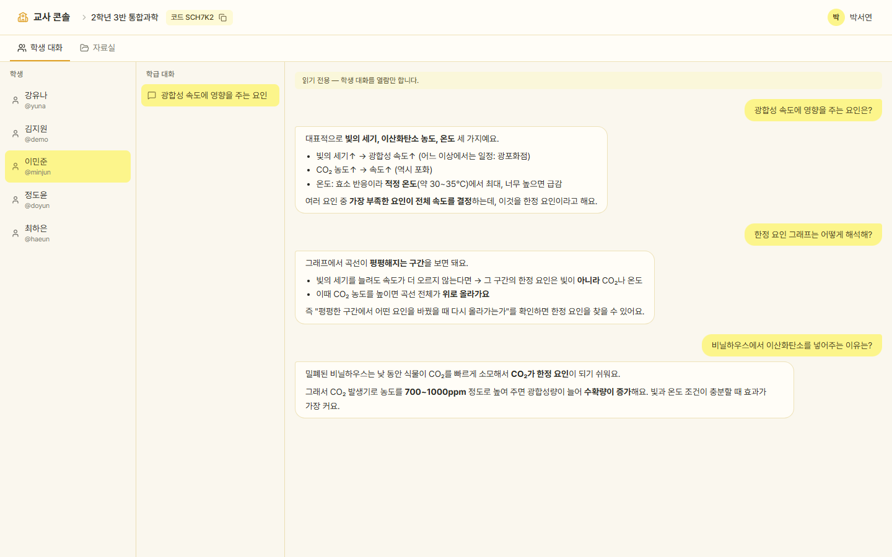<br><sub>Teacher console: student thread</sub></td>
  </tr>
  <tr>
    <td align="center">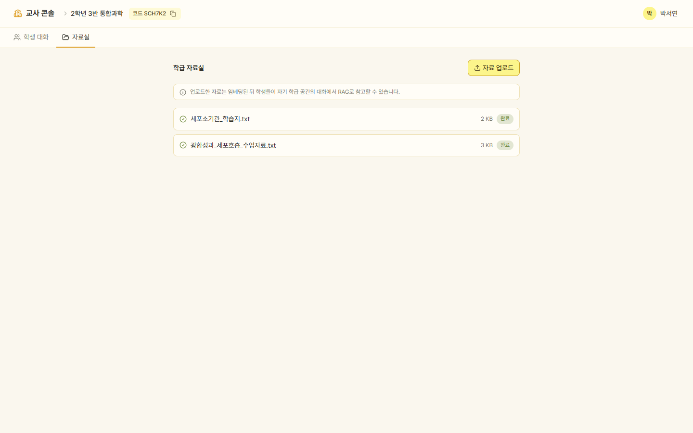<br><sub>Class materials</sub></td>
    <td align="center">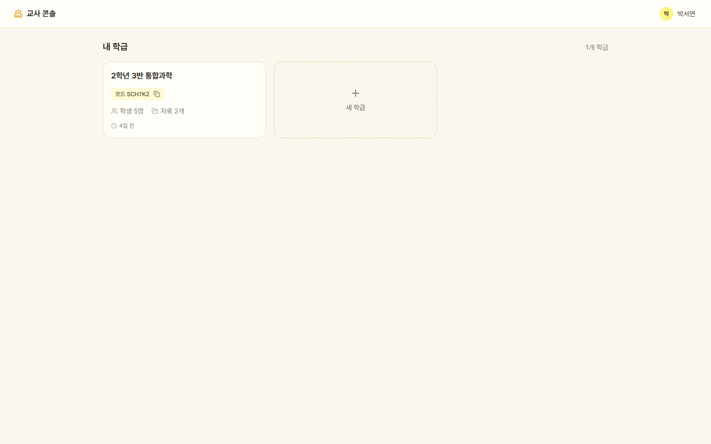<br><sub>Teacher console: classes</sub></td>
  </tr>
  <tr>
    <td align="center">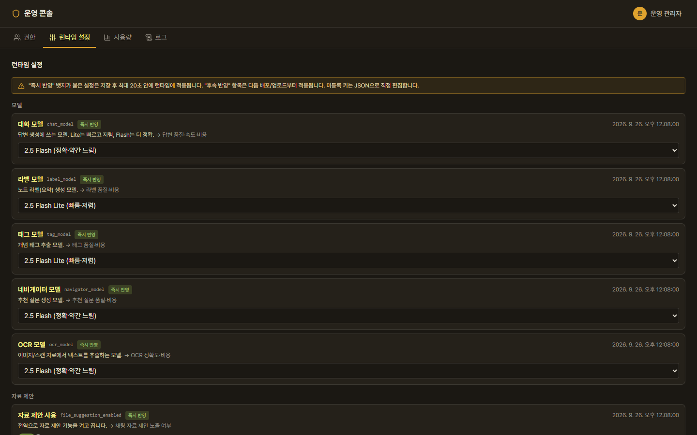<br><sub>Admin: runtime settings</sub></td>
    <td align="center">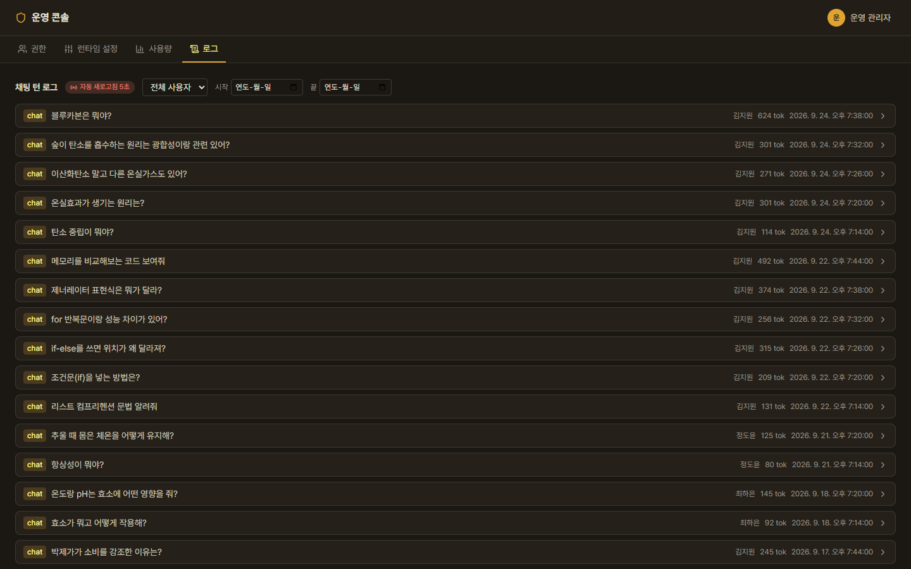<br><sub>Admin: chat logs</sub></td>
  </tr>
</table>

---

## 📝 License

MIT License. See [LICENSE](LICENSE) for details.

| 👤 Developer | ✉️ Email |
|:---:|:---:|
| Zanviq | zanviq.dev@gmail.com |
